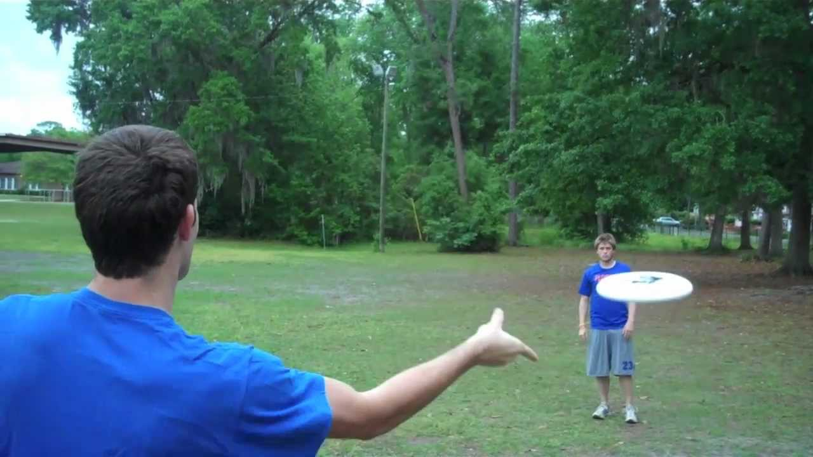

# September 29 2023
I added code to make a box around the frisbee so that it was easier to track and easier to isolate from the rest of the video. I only took the colors from inside to box and averaged them to try to find the rotation of the frisbee. This goal was to decrease how much data picked up from other sources than the frsibee affected the outcome.

https://www.scientificamerican.com/article/bring-science-home-frisbee-aerodynamics/

# October 2 2023
I cut the video I had of the orange frisbee to get just the time the frisbee was in the air to see if it would make a clearer graph of the change in color. The graph overall looked nicer and more compact but it still didn't show any definitive data.

# October 4 2023
I went back to the code for the mask used to find the orange pixels in the video and edited the nubmers so that there was less pixels picked up from the enviornment.

# October 18 2023
I used a sharpie to color one side of a frisbee so that it would be easy to tell the difference between the two sides on a video.